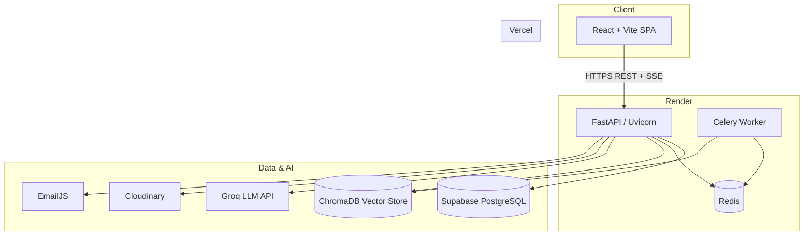

# Yaatra Saathi

AI-powered companion for the **Nanda Devi Raj Jat Yatra** — a sacred Himalayan pilgrimage held every twelve years in Uttarakhand, India. Yaatra Saathi helps pilgrims explore the route, read cultural stories, connect with the community, and get guidance from a knowledge-driven AI assistant.

## Live deployment

| Service   | Platform | URL / Role                                      |
|-----------|----------|-------------------------------------------------|
| Frontend  | Vercel   | [yaatra-saathi.vercel.app](https://yaatra-saathi.vercel.app/) |
| Backend   | Render   | FastAPI REST + streaming API (see [DEPLOYMENT.md](./DEPLOYMENT.md)) |
| Database  | Supabase | PostgreSQL                                      |
| Cache     | Render / Upstash | Redis (sessions, rate limits, Celery)     |

> **Note:** Backend was previously on Railway. After the Railway trial expired, migrate to Render — full steps in [DEPLOYMENT.md § Migrating from Railway](./DEPLOYMENT.md#migrating-from-railway).

## Features

- **AI chat** — Streaming RAG assistant with multi-agent routing (history, route, ritual, safety, general)
- **Interactive map** — Yatra stops, route layers, elevation profile (Leaflet)
- **Stories** — Featured and browsable pilgrimage narratives
- **Community feed** — Posts, image uploads, threaded comments, likes
- **Authentication** — Email/password with OTP verification, JWT + refresh cookies, Google OAuth
- **Admin panel** — Document upload, knowledge-base ingestion, system readiness checks

## Architecture



### Request flow (chat)

1. User sends a message from the **Chat** page.
2. Frontend opens an SSE stream to `POST /chat/stream` with JWT auth.
3. Backend runs the **LangGraph multi-agent pipeline**: router → specialist agent → verifier → synthesizer.
4. Relevant chunks are retrieved from **ChromaDB** (HuggingFace embeddings).
5. Response tokens stream back to the client in real time.

### Backend layers

| Layer        | Path              | Responsibility                                      |
|--------------|-------------------|-----------------------------------------------------|
| Routers      | `backend/routers/` | HTTP endpoints (auth, chat, posts, map, admin…)    |
| Services     | `backend/services/`| Business logic (auth, posts, comments, uploads)    |
| Models       | `backend/models/`  | SQLAlchemy ORM (users, posts, stories, stops, chat)|
| Schemas      | `backend/schemas/` | Pydantic request/response validation               |
| Core         | `backend/core/`    | Config, JWT security, dependencies, rate limiting  |
| RAG          | `backend/rag/`     | Ingestion, vector store, LangGraph agents          |
| Tasks        | `backend/tasks/`   | Celery jobs (email, document ingestion)            |
| Migrations   | `backend/alembic/` | Database schema migrations                         |

### Frontend layers

| Layer        | Path                    | Responsibility                           |
|--------------|-------------------------|------------------------------------------|
| Pages        | `frontend/src/pages/`   | Route-level screens                      |
| Components   | `frontend/src/components/`| UI, layout, map, chat, feed widgets   |
| Hooks        | `frontend/src/hooks/`   | Data fetching and domain logic           |
| Context      | `frontend/src/context/` | Auth and theme providers                 |
| Services     | `frontend/src/services/`| Axios API client and endpoint wrappers   |
| Store        | `frontend/src/store/`   | Zustand client state (chat sessions)     |
| Types        | `frontend/src/types/`   | Shared TypeScript interfaces             |

## Repository structure

```text
yaatra-saathi/
├── README.md                 # Project overview (this file)
├── DEPLOYMENT.md             # Render, Vercel, Supabase deployment guide
├── render.yaml               # Render Blueprint (optional IaC)
├── backend/
│   ├── main.py               # FastAPI app entrypoint
│   ├── alembic/              # Database migrations
│   ├── core/                 # Settings, security, middleware
│   ├── db/                   # SQLAlchemy engine and session
│   ├── models/               # ORM models
│   ├── routers/              # API route modules
│   ├── schemas/              # Pydantic schemas
│   ├── services/             # Business logic
│   ├── rag/                  # RAG pipeline and agent graph
│   │   ├── agents/           # LangGraph specialist agents
│   │   └── documents/        # Seed knowledge-base text files
│   ├── tasks/                # Celery background tasks
│   ├── tests/                # API contract tests
│   ├── requirements.txt
│   └── pyproject.toml
└── frontend/
    ├── src/
    │   ├── pages/            # Home, Chat, Map, Feed, Stories, Admin…
    │   ├── components/       # Reusable UI
    │   ├── context/          # AuthContext, ThemeContext
    │   ├── hooks/            # useAuth, useChat, usePosts…
    │   ├── services/         # api.ts — centralized HTTP client
    │   └── types/            # TypeScript models
    ├── vercel.json           # SPA rewrites for client-side routing
    ├── package.json
    └── vite.config.ts
```

## Tech stack

### Backend

- **FastAPI** — REST API and SSE streaming
- **SQLAlchemy + Alembic** — ORM and migrations
- **PostgreSQL** (Supabase) — Primary datastore
- **Redis + Celery** — Rate limiting, refresh-token storage, async ingestion
- **ChromaDB + LangChain + LangGraph** — Vector store and multi-agent RAG
- **Groq** — LLM inference (`llama-3.3-70b-versatile`)
- **Cloudinary** — Image uploads for posts
- **EmailJS** — OTP and welcome emails

### Frontend

- **React 19 + TypeScript + Vite**
- **React Router** — Client-side routing with protected/admin routes
- **TanStack Query** — Server state and caching
- **Tailwind CSS v4** — Styling
- **Zustand** — Chat session state
- **Leaflet / React Leaflet** — Interactive yatra map
- **Axios + fetch** — REST and streaming chat

## Database schema

| Table            | Purpose                                      |
|------------------|----------------------------------------------|
| `users`          | Accounts, roles, OAuth, email verification   |
| `posts`          | Community feed posts                         |
| `post_comments`  | Threaded comments and replies                |
| `comment_likes`  | Comment like tracking                        |
| `stories`        | Pilgrimage story content                     |
| `yatra_stops`    | Map stop coordinates and metadata            |
| `chat_sessions`  | User chat session metadata                   |
| `chat_messages`  | Persisted chat history per session           |

## API overview

| Prefix            | Endpoints (summary)                                      |
|-------------------|----------------------------------------------------------|
| `/health`         | Liveness and readiness probes                            |
| `/auth`           | Register, login, OTP, refresh, profile, Google OAuth   |
| `/posts`          | CRUD for community posts                                 |
| `/posts/.../comments` | Comment threads, likes, replies                     |
| `/stories`        | List and detail by slug                                  |
| `/map`            | Yatra stop listing and detail                            |
| `/chat`           | RAG status, streaming chat, document ingest              |
| `/chat/session`   | Session CRUD and history                                 |
| `/upload`         | Image upload (Cloudinary)                                  |
| `/admin`          | Document management and ingestion triggers               |

Interactive docs: `{BACKEND_URL}/docs`

## Local development

### Prerequisites

- Python 3.12+
- Node.js 20+
- PostgreSQL
- Redis

Optional for full features: Groq API key, Cloudinary, EmailJS, Google OAuth credentials.

### Backend

```bash
cd backend
python -m venv .venv
source .venv/bin/activate
pip install -r requirements.txt
cp .env.example .env   # fill in values
alembic upgrade head
uvicorn main:app --reload --host 0.0.0.0 --port 8000
```

Optional Celery worker (email + ingestion):

```bash
celery -A celery_app worker --loglevel=info
```

### Frontend

```bash
cd frontend
npm install
cp .env.example .env   # set VITE_API_URL=http://localhost:8000
npm run dev
```

Open `http://localhost:5173`. The Vite dev server proxies `/api` to the backend when configured; in production the frontend calls `VITE_API_URL` directly.

### Environment variables

**Backend** — see `backend/.env.example` for the full list. Required:

- `DATABASE_URL`, `REDIS_URL`, `SECRET_KEY`, `ALGORITHM`
- `FRONTEND_URL` (for CORS and OAuth redirects)

**Frontend**:

- `VITE_API_URL` — Backend base URL (e.g. `http://localhost:8000`)

## Testing

```bash
cd backend
python -m unittest -v tests/test_api_contracts.py
```

See `backend/RELEASE_CHECKLIST.md` for pre-deploy verification steps.

## License

Add your preferred license before publishing.
